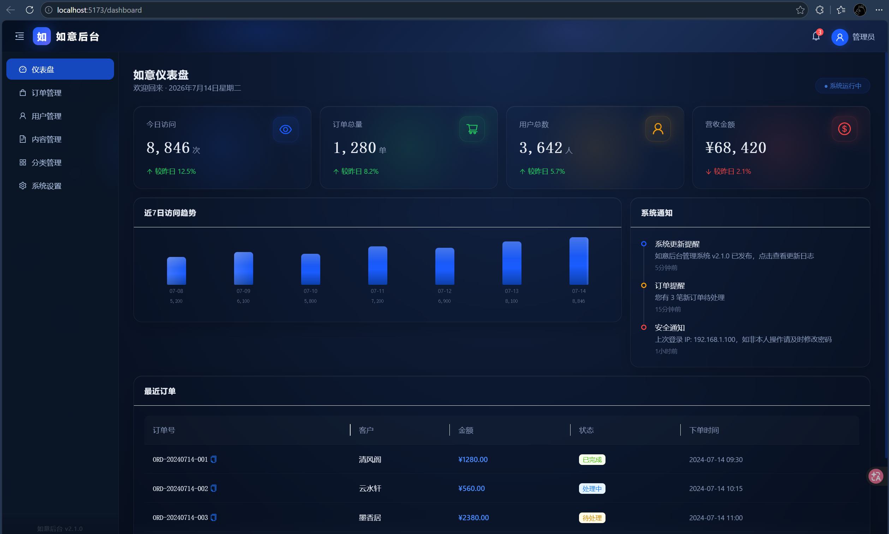

# 如意后台管理系统 · RuyiGinReactAdmin

> 基于 **React 19 + Vite + TypeScript + Ant Design + framer-motion** 的现代化通用后台管理系统骨架。
> 
> 后端计划使用 **Go + Gin** 框架（`backend/` 目录），前端先行已开发完毕。



---

## ✨ 特性

| 特性 | 说明 |
|------|------|
| 🎨 **如意国风科技蓝** | 深空渐变 + 科技蓝主色 + 国风金色点缀 |
| 🔮 **玻璃拟态** | `backdrop-filter: blur(20px)` 毛玻璃卡片风格 |
| 🏔️ **3D 悬浮交互** | 鼠标追踪 3D 旋转（`useMotionValue` + `useSpring`） |
| 🌊 **动态粒子背景** | Canvas 粒子场 + 粒子间连接线动画 |
| 🔢 **数字滚动动画** | easeOutExpo 缓动统计数值动画 |
| ✨ **炫光跟随** | 鼠标位置径向渐变光斑跟随 |
| 💠 **组件化架构** | 4 层（UI → Business → Pages → Router）严格单向依赖 |
| 🧩 **可复用 UI 库** | 9 个通用 UI 组件，零业务依赖，直接 props 配置 |
| 🏪 **业务组件层** | 4 个预置业务组件开箱即用 |
| 🌙 **深色科技风** | 完整适配深色背景的主题系统 |

---

## 🚀 快速开始

```bash
# 进入前端目录
cd frontend

# 安装依赖
npm install

# 启动开发服务器（默认 http://localhost:5173）
npm run dev
```

## 📁 项目结构

```
RuyiGinReactAdmin/
├── frontend/                         # 前端（React + Vite）
│   └── src/
│       ├── ui/                       # 通用 UI 组件（零业务依赖）
│       │   ├── CountUp/              数字滚动
│       │   ├── TiltCard/             3D 悬浮 + 炫光跟随
│       │   ├── GlassCard/            玻璃拟态卡片
│       │   ├── GlassBarChart/        渐变柱状图 + 波浪光泽
│       │   ├── ParticleBg/           Canvas 粒子背景
│       │   ├── RippleBorder/         水波纹边框
│       │   ├── GradientBorder/       流光渐变边框
│       │   ├── AnimatedRow/          表格行入场动画
│       │   └── StatCard/             统计卡片（组合）
│       ├── business/                 业务组件
│       │   ├── DashboardStats/       统计卡片组
│       │   ├── VisitChart/           访问趋势图表
│       │   ├── OrderTable/           订单表格
│       │   └── NotificationTimeline/ 通知时间线
│       ├── pages/Dashboard/          仪表盘页面（~40 行编排）
│       ├── router/                   路由配置
│       ├── hooks/                    自定义 Hooks
│       ├── mock/                     Mock 数据
│       ├── theme/                    主题系统（Design Token）
│       └── types/                    类型定义
├── backend/                          # 后端（Go + Gin，待开发）
└── docs/                             # 架构文档
```

## 🧩 二次开发

### 新页面开发
1. 在 `src/pages/` 下新建页面
2. 从 `ui/` 引入通用组件快速搭建
3. 添加 `business/` 业务组件（可选）
4. 在 `router/` 中添加路由

### 换肤/换品牌
只需修改 `src/theme/config.ts` 一个文件中的 `themeColors` 对象。

### 复制到新项目
```bash
# 复制核心组件库即可获得完整视觉系统
cp -r frontend/src/{ui,theme,hooks} your-new-project/src/
```

## 🛣️ 开发路线图

- [x] 前端基础布局（顶部 + 侧栏 + 内容区）
- [x] 玻璃拟态 + 3D 悬浮 + 粒子背景
- [x] 增强视觉效果（动画/炫光/水波纹）
- [x] 组件化架构重构（ui/ + business/ + pages/）
- [ ] 后端 Go + Gin 开发
- [ ] 完整的 CRUD 页面
- [ ] 权限管理系统
- [ ] 暗色/亮色主题切换
- [ ] 组件库独立发布（npm package）

## 📄 架构文档

详细架构方案请参阅：
- [`docs/ARCHITECTURE.md`](docs/ARCHITECTURE.md) — 完整组件化架构
- [`docs/component-library-engineering-plan.md`](docs/component-library-engineering-plan.md) — 工程化与发布方案

## 🛠️ 技术栈

| 前端 | 后端（规划） |
|------|------------|
| React 19 | Go + Gin |
| TypeScript 6 | GORM |
| Vite 8 | MySQL / PostgreSQL |
| Ant Design 6 | RESTful API |
| framer-motion 12 | JWT 认证 |

---

<p align="center">
  <strong>如意吉祥 · 万事如意</strong>
</p>
